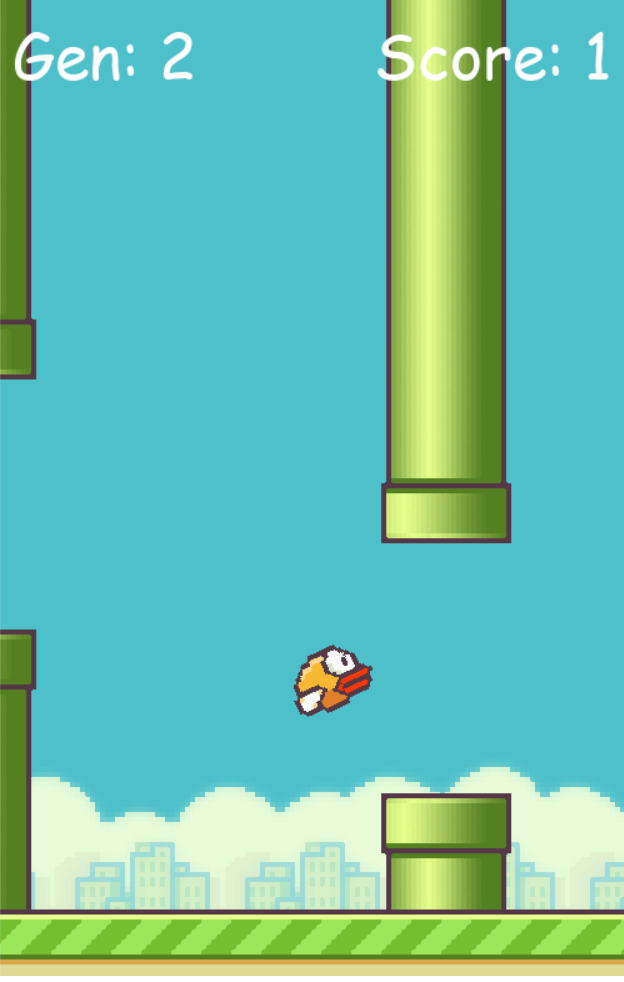

<div align="center">
  <h1> Flappy Bird AI </>
  
</div>


Flappy Bird is a classic game where the player controls a bird through pipes with only one control : jumping.

In this implementation we use a genetic algorithm (NEAT) that generate a population of bird maximise our score. 

## Screenshot
<div align="center">
  
</div>

## Install

To install the current version: *(Ubuntu and
Windows)*:

```
$ pip -r requirements.txt
```

To launch the program:

```
$ python game.py
```

## Resources

*   [TechWithTim Youtube](https://www.youtube.com/@TechWithTim)
*   [NEAT Algorithm documentation](https://neat-python.readthedocs.io/)
*   [NEAT Algorithm Paper](https://nn.cs.utexas.edu/downloads/papers/stanley.ec02.pdf)
*   [PyGame documentation](https://www.pygame.org/docs/)